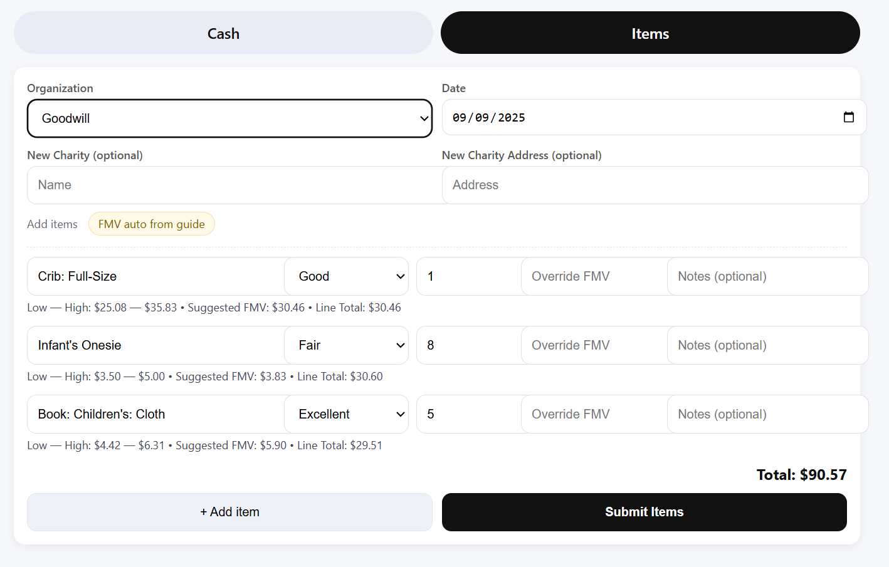

# Donation Tracker (Google Sheets + Apps Script Web App)

A simple, mobile-friendly app to log **cash** and **non-cash (items)** donations straight into Google Sheets — with fair-market value (FMV) lookups from the included value guide in the template.

- Works great on your phone (Add to Home Screen)
- Organization dropdown from your sheet; add new charities inline
- Items: Low–High range + Suggested FMV (midpoint × condition, clamped)
- One tap logs to `Donations_Log`

---

## Step 1: Get the starter file into Google Sheets

1. Download **`Donations_Tracker_Template.xlsx`** from this repo.
2. Open **Google Drive**: https://drive.google.com
3. Click **+ New → File upload**, select `Donations_Tracker_Template.xlsx`.
4. After it uploads, **right-click the file → Open with → Google Sheets**.
5. In the new tab that opens, click **File → Save as Google Sheets**.
   - This creates a true Google Sheets version you can edit.
   - Optional: rename it to something like **My Donations Tracker**.
6. (Optional) You can now delete the original Excel file in Drive; you’ll use the Google Sheets copy going forward.

> Tip: You can also do **File → Import → Upload** inside an empty Google Sheet and select the Excel file. Choose “**Replace spreadsheet**” if prompted.

---

## Step 2: Add the Web App code (Apps Script)

1. In your Google Sheet, go to **Extensions → Apps Script**.
2. In the left sidebar, delete any default `Code.gs` if it was auto-created.
3. Create two files:
   - **File → New file → Script** → name it **`Code.gs`**  
     Paste in the contents of `Code.gs` from this repo.
   - **File → New file → HTML** → name it **`index.html`**  
     Paste in the contents of `index.html` from this repo.
4. In **`Code.gs`**, set your Sheet ID:

```javascript
const SHEET_ID = "YOUR_SHEET_ID_HERE";
```

- To find your Sheet ID: open your Google Sheet and look at the URL:  
  `https://docs.google.com/spreadsheets/d/XXXXXXXXXXXXXXXXXXXXXXXXXXXX/edit`  
  Copy the long string between `/d/` and `/edit` and paste it into `SHEET_ID`.

> **Privacy tip:** Don’t commit your personal Sheet ID back to GitHub if your repo is public. It only lives in your private Apps Script project.

---

## Step 3: Deploy as a Web App

1. In Apps Script, click **Deploy → New deployment**.
2. Under **Select type**, choose **Web app**.
3. Set:
   - **Execute as:** **Me**
   - **Who has access:** **Anyone with the link** (or restrict to yourself)
4. Click **Deploy** and authorize if prompted.
5. Copy the **Web App URL** shown after deployment.

---

## Step 4: Use it (desktop or phone)

- Open the Web App URL.
- It has two tabs: **Cash** and **Items**.

**Cash**
1. Pick an existing organization from the dropdown, or type a **New Charity** name + optional address.
2. Set **Date**, **Amount**, and **Method** (Cash/Credit Card).
3. Click **Submit Cash**. (The button disables briefly to prevent double-taps.)

**Items**
1. Pick an organization and date (you can also enter a new charity).
2. Click **+ Add item**. Start typing an item name; matches come from your **ValueGuide_Custom** tab.
3. The app shows **Low—High** and a **Suggested FMV** based on condition (Poor/Fair/Good/Excellent).  
   - You can **override** the FMV if you disagree.
4. Add more items as needed, then click **Submit Items**.

All submissions append rows into the **`Donations_Log`** sheet.

> **Mobile tip:** On iOS Safari or Android Chrome, open the Web App URL and **Add to Home Screen** for an app-like experience.

---

## What’s already in the template

The Google Sheets template (`Donations_Tracker_Template.xlsx`) includes three tabs:

- **`Donations_Log`** — where submissions are recorded.  
  Headers (row 1):  
  `Charity | Charity Address | Date | Donation Type | IRS Donation Type Classification | Description | Donation Value in $`

- **`Charities`** — your organization list:  
  `Charity | Charity Address`

- **`ValueGuide_Custom`** — your FMV list with columns:  
  `Category | Item | Low | High`  
  (This repo’s template already contains a fully populated list, so you don’t need a separate CSV.)

You can edit/expand **Charities** and **ValueGuide_Custom** at any time — the app picks up changes automatically.

---

## Troubleshooting (common issues)

- **I don’t see any organizations/items in the web app.**  
  Make sure you’re using the **Google Sheets** version (not the original Excel). Verify the tab names match exactly:  
  `Donations_Log`, `Charities`, `ValueGuide_Custom`.

- **“Sheet not found” or errors when loading.**  
  Confirm you pasted the correct **SHEET_ID** in `Code.gs`. It must be the ID of your new Google Sheet copy (the one you saved as Google Sheets).

- **Item suggestions show “—”.**  
  Ensure the item exists in **`ValueGuide_Custom`** with **Item** in column **B**, **Low** in **C**, **High** in **D`, starting on row 2 (row 1 is headers).

- **Buttons are disabled after I click.**  
  That’s expected briefly during submission to prevent accidental double-submits. They’ll re-enable automatically after the request finishes.

- **I want to keep the web app private.**  
  When deploying, set **Who has access** to **Only myself** (you’ll need to be signed in to use it).

---

## Notes & disclaimer

- Licensed under **MIT** — feel free to fork or adapt.
- This tool provides a convenience workflow for record-keeping. It is **not tax advice**; FMV values are guidelines only. For details, see IRS Publications **561** and **526**.

